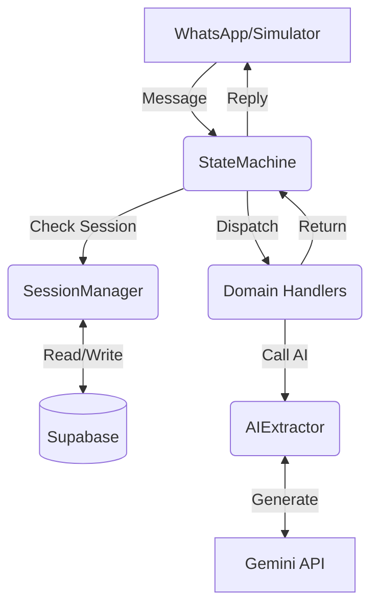

# Technical Design: wa_toolkit

**Status**: Draft
**Version**: 1.0.0
**Author**: Replate Engineering

## 1. Objective
To provide a reusable, modular Python framework for building multi-turn WhatsApp chatbots. The toolkit abstracts the "plumbing" (session persistence, state routing, AI extraction, and local simulation) so developers can focus exclusively on conversation logic and domain-specific actions.

## 2. System Architecture



## 3. Core Components

### 3.1 SessionManager (`session.py`)
Responsible for persistence. It assumes a specific PostgreSQL schema in Supabase but allows for a custom table name.

**Implementation Details:**
- **Storage**: Supabase `JSONB` for `temp_data` to allow arbitrary key-value storage per project.
- **Atomicity**: Uses standard Supabase `.upsert()` and `.update()` calls.
- **Methods**:
    - `get(phone)`: Returns a `dict` representing the session.
    - `create(phone, state)`: Initializes a session.
    - `update(phone, state, data)`: The primary method used by the `StateMachine` to persist handler results.

### 3.2 StateMachine (`state_machine.py`)
The orchestrator. It manages the lifecycle of a message from arrival to reply.

**Key Features:**
- **Command Interception**: Intercepts "system" commands (`RESET`, `STOP`, `NEW`) before they reach domain handlers.
- **Robust Error Handling**: Wraps handler execution in `try/except`.
- **Stateless Dispatch**: Handlers are looked up by the `state` string retrieved from the `SessionManager`.

**Signature:**
```python
def handle(self, phone: str, message: Any) -> str:
    """
    1. Fetch session from SessionManager.
    2. Check for Global Commands (RESET, STOP, etc).
    3. Resolve current handler based on session state.
    4. Execute handler(phone, message, temp_data).
    5. Persist next_state and updated_data.
    6. Return response string.
    """
```

### 3.3 AIExtractor (`ai_extractor.py`)
A wrapper around the Google GenAI SDK (Gemini) with built-in resilience.

**Robustness Strategy:**
- **Exponential Backoff**: 5 retries starting at 4s.
- **Model Fallback**: If `gemini-flash-latest` fails (quota/errors), it automatically tries `gemini-flash-lite-latest`.
- **Offline Mode**: If `MOCK_AI=true`, it skips the API and calls a project-provided `mock_fn`. This is essential for CI/CD and local development.

### 3.4 Simulator (`simulator.py`)
A REPL-based interface for rapid prototyping.

**Features:**
- Uses `argparse` to allow overriding the phone number via `--phone`.
- Simulates the "Bot Response" delay and formatting.

## 4. Error Handling & Exceptions (`errors.py`)
The toolkit defines a hierarchy of exceptions to ensure specific failures can be handled gracefully:

- `WAToolkitError`: Base class.
- `AIExtractionError`: Failed after all retries and fallbacks.
- `SessionError`: Database connection or schema mismatch issues.
- `StateNotFoundError`: Attempted to transition to a state with no registered handler.

## 5. Data Flow (Sequence Diagram)

1.  **Incoming Message**: `StateMachine.handle("+1415...", "I have bread")`
2.  **Session Lookup**: `SessionManager.get("+1415...")` -> returns `{state: 'AWAITING_DESC', data: {}}`
3.  **Dispatch**: Calls `registered_handlers['AWAITING_DESC']`
4.  **AI Extraction**: Handler calls `AIExtractor.extract(prompt, schema)`
5.  **State Update**: Handler returns `("Does this look right?", "AWAITING_REVIEW", {"items": ["bread"]})`
6.  **Persistence**: `SessionManager.update("+1415...", "AWAITING_REVIEW", {"items": ["bread"]})`
7.  **Reply**: User receives "Does this look right?"

## 6. Engineering Standards

- **Type Safety**: Use Python type hints (`typing`) for all method signatures.
- **Explicit Versioning**: All internal dependencies (Supabase, Google GenAI) are pinned in `requirements.txt`.
- **Environment Driven**: Secrets (API Keys) are NEVER hardcoded; always retrieved via `os.environ`.

## 7. V2 Future Proofing

- **Adapter Pattern**: The `StateMachine` will be updated to accept a `Message` object instead of a `str` to support multi-media inputs (images/audio).
- **Storage Adapters**: Interface-based `SessionManager` to support Redis or In-Memory storage for testing.
